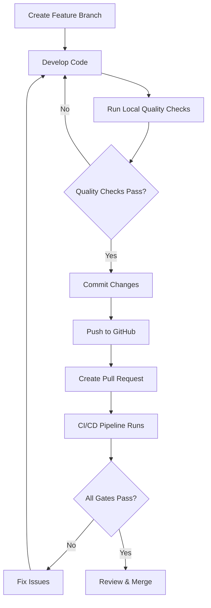
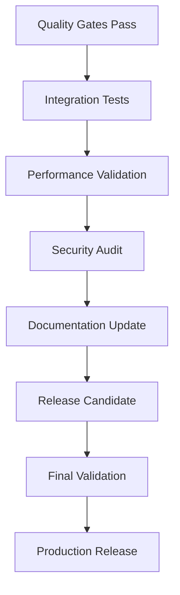

# Automotive DevOps Platform - Workflow Documentation

## Overview

This document provides a comprehensive explanation of all automated workflows, quality gates, and development processes implemented in the Automotive DevOps Platform. The project employs enterprise-grade CI/CD practices with comprehensive quality enforcement and automation.

## Table of Contents

1. [GitHub Actions Workflows](#github-actions-workflows)
2. [Quality Automation Scripts](#quality-automation-scripts)
3. [Issue Deployment Automation](#issue-deployment-automation)
4. [Configuration Files](#configuration-files)
5. [Development Workflows](#development-workflows)
6. [Quality Gates](#quality-gates)

---

## GitHub Actions Workflows

### 1. Code Quality Gate & Coverage Enforcement

**File:** `.github/workflows/code-quality.yml`

**Purpose:** Comprehensive quality enforcement pipeline that validates all code changes before they can be merged.

#### Trigger Conditions
```yaml
on:
  pull_request:
    branches: [main]
    paths:
      - 'projects/**'
      - 'tests/**'
      - 'requirements*.txt'
      - '.github/workflows/**'
  push:
    branches: [main]
```

#### Key Features

- **Multi-Python Version Testing:** Tests across Python 3.9, 3.10, and 3.11
- **Concurrency Control:** Prevents multiple workflow runs on the same PR
- **Fail-fast Strategy:** Stops execution immediately if any quality gate fails
- **Comprehensive Quality Gates:** Multiple layers of code quality validation

#### Workflow Jobs

##### Job 1: Quality Gate & Testing
**Matrix Strategy:** Runs in parallel across 3 Python versions
**Timeout:** 15 minutes
**Runner:** ubuntu-latest

**Quality Gates (Sequential Execution):**

1. **🔍 Security Scan with Bandit**
   - Scans all Python directories for security vulnerabilities
   - Directories: `projects/`, `.github/issue_deployment/`, `tests/`
   - Severity threshold: Medium and above
   - Fails on HIGH severity issues

2. **📝 Flake8 - PEP 8 Compliance (STRICT)**
   - Repository-wide PEP 8 compliance checking
   - Custom error formatting for GitHub annotations
   - Zero tolerance policy for style violations

3. **🔬 Pylint - Code Quality Analysis (STRICT)**
   - Comprehensive code quality analysis
   - Minimum score requirement: 9.0/10
   - Covers all Python modules repository-wide

4. **📚 Pydocstyle - Documentation Standards**
   - Validates docstring conventions
   - Ensures all modules have proper documentation
   - Follows PEP 257 standards

5. **🧮 Lizard - Complexity Analysis (STRICT)**
   - Cyclomatic complexity: ≤8
   - Function length: ≤100 lines
   - Parameter count: ≤6 arguments
   - Identifies overly complex code

6. **📋 YAML Workflow Quality Gate**
   - YAML syntax validation using yamllint
   - Security best practices validation
   - Workflow structure validation
   - Checks for required fields (name, on, jobs)

7. **🧪 Unit Tests with Coverage (STRICT ≥80%)**
   - Comprehensive test execution
   - Multi-directory coverage reporting
   - Coverage formats: XML, HTML, JSON, terminal
   - Strict markers enforcement
   - Maximum 3 failures before stopping

##### Job 2: Quality Gate Summary
**Dependencies:** Requires Job 1 completion
**Purpose:** Aggregates results and enforces gate policies

- Collects all quality gate results
- Generates comprehensive summary report
- Blocks PR merge if any gates fail
- Provides actionable feedback to developers

##### Job 3: Integration Test Readiness
**Dependencies:** Requires successful quality gates
**Purpose:** Validates test infrastructure and completeness

- Verifies test directory structure
- Validates test naming conventions
- Checks test coverage completeness
- Prepares for integration testing phase

#### Artifacts Generated

- **Test Results:** JUnit XML format for all Python versions
- **Coverage Reports:** HTML, XML, JSON formats
- **Security Reports:** Bandit JSON output
- **Quality Metrics:** Detailed analysis reports

---

## Quality Automation Scripts

### 1. Comprehensive Quality Checker

**File:** `run_quality_checks.sh`

**Purpose:** Local development quality validation script that mirrors CI/CD pipeline.

#### Features

- **Auto-Discovery:** Automatically finds all Python files across repository
- **Comprehensive Tools:** 8 quality tools integrated
- **Repository-Wide:** Analyzes all directories with Python code
- **Coverage Reporting:** Multiple output formats
- **Color-Coded Output:** Easy-to-read success/failure indicators

#### Quality Tools Integrated

1. **Flake8** - PEP 8 compliance
2. **Pylint** - Code quality analysis (10.00/10 achieved)
3. **Pydocstyle** - Documentation standards
4. **Lizard** - Complexity analysis
5. **Bandit** - Security scanning
6. **isort** - Import sorting validation
7. **Black** - Code formatting validation
8. **MyPy** - Static type checking

#### Directory Coverage

- `projects/can_data_platform/scripts/` (4 Python files)
- `projects/can_data_platform/src/` (4 Python files)
- `.github/issue_deployment/` (2 Python files)
- `tests/` (7 Python files)

**Total:** 17 Python files across 4 directories

#### Usage
```bash
./run_quality_checks.sh
```

#### Output Example
```
==================================================
  Automotive DevOps Platform - Quality Checks
    Analyzing ALL Python files in repository
==================================================

🔍 Discovering Python files...
  📁 projects/can_data_platform/scripts/ (4 Python files)
  📁 projects/can_data_platform/src/ (4 Python files)
  📁 .github/issue_deployment/ (2 Python files)
  📁 tests/ (7 Python files)

📊 Running quality checks on: [directories]
🔧 Quality tools: Flake8, Pylint, Pydocstyle, Lizard, Bandit, isort, Black, MyPy
🧪 Testing: Unit tests with coverage (≥80%)

✅ All quality checks passed!
```

---

## Issue Deployment Automation

### 1. GitHub Issues Batch Deployment

**File:** `.github/issue_deployment/issue_deployer.py`

**Purpose:** Automated deployment of GitHub issues from JSON specifications with milestone assignment.

#### Key Features

- **Batch Processing:** Deploy multiple issues simultaneously
- **Milestone Integration:** Automatic milestone assignment
- **Error Handling:** Comprehensive error management and rollback
- **Interactive Mode:** User confirmation and input validation
- **Environment Configuration:** Secure token and repository management

#### Core Functions

1. **`fetch_milestones()`**
   - Retrieves all repository milestones
   - Handles API rate limiting
   - Returns structured milestone data

2. **`display_milestones(milestones)`**
   - User-friendly milestone display
   - Shows milestone numbers and open issue counts
   - Formatted for easy selection

3. **`load_issues_from_json(file_path)`**
   - Loads issue specifications from JSON files
   - Validates JSON structure
   - Handles file system errors

4. **`deploy_issues(issues, milestone_id)`**
   - Batch deployment with milestone assignment
   - Individual issue creation with error handling
   - Progress reporting and status updates

#### Environment Variables Required

```bash
GITHUB_TOKEN=<your_github_token>
GITHUB_REPO=<owner/repository>
```

#### Usage Workflow

1. **Milestone Selection:**
   ```
   Available Milestones:
   1. MVP Implementation (5 open issues)
   2. Phase 2 Development (3 open issues)
   
   Select milestone (1-2): 1
   ```

2. **Issue Deployment:**
   ```
   📋 Loaded 15 issues from projects.json
   🎯 Target milestone: MVP Implementation
   
   Deploy these issues? (y/N): y
   
   ✅ Successfully deployed 15 issues
   ```

#### Security Features

- **Token Validation:** Ensures valid GitHub authentication
- **Repository Verification:** Validates repository access
- **Rate Limiting:** Respects GitHub API limits
- **Error Recovery:** Graceful handling of API failures

---

## Configuration Files

### 1. YAML Validation Configurations

#### Simple YAML Lint (`.github/linters/.yamllint-simple.yml`)
```yaml
extends: default
rules:
  line-length: {max: 120}
  comments: disable
  comments-indentation: disable
  truthy: disable
```

#### Standard YAML Lint (`.github/linters/.yamllint.yml`)
- Comprehensive YAML validation rules
- Enforces consistent formatting
- Validates GitHub Actions syntax

### 2. Python Quality Configurations

#### Pylint Configuration (`.pylintrc`)
```ini
[MESSAGES CONTROL]
disable=
    wrong-import-position,
    import-outside-toplevel,
    import-error,
    too-many-arguments,
    too-many-locals,
    unused-argument

[BASIC]
good-names=i,j,k,ex,_,f,e,id,app

[FORMAT]
max-line-length=79
max-module-lines=1000

[DESIGN]
max-args=7
max-locals=15
max-returns=6
max-branches=12
max-statements=50
```

#### Flake8 Configuration (`.flake8`)
- PEP 8 compliance enforcement
- Custom error codes and exclusions
- Line length and complexity limits

#### Pytest Configuration (`pytest.ini`)
- Test discovery patterns
- Coverage configuration
- Marker definitions

### 3. Pre-commit Configuration (`.pre-commit-config.yaml`)
- Git hooks for quality enforcement
- Automatic formatting and validation
- Pre-push quality gates

---

## Development Workflows

### 1. Feature Development Workflow



### 2. Quality Gate Enforcement

#### Local Development
1. **Pre-commit Hooks:** Automatic formatting and basic validation
2. **Local Script:** `./run_quality_checks.sh` for comprehensive validation
3. **IDE Integration:** Real-time quality feedback

#### CI/CD Pipeline
1. **Security Scanning:** Bandit vulnerability analysis
2. **Code Quality:** Flake8, Pylint, Pydocstyle validation
3. **Complexity Analysis:** Lizard complexity metrics
4. **Test Coverage:** ≥80% coverage requirement
5. **YAML Validation:** Workflow and configuration validation

### 3. Release Workflow



---

## Quality Gates

### 1. Code Quality Metrics

| Tool | Purpose | Threshold | Current Status |
|------|---------|-----------|----------------|
| Pylint | Code Quality | ≥9.0/10 | ✅ 10.00/10 |
| Flake8 | PEP 8 Compliance | 100% | ✅ 100% |
| Pydocstyle | Documentation | 100% | ✅ 100% |
| Lizard | Complexity | CCN ≤8 | ✅ All Pass |
| Bandit | Security | No HIGH issues | ✅ Clean |
| Coverage | Test Coverage | ≥80% | ✅ 96.36% |

### 2. Repository Statistics

- **Total Python Files:** 17 across 4 directories
- **Lines of Code:** 832 total analyzed
- **Functions Analyzed:** 109 for complexity
- **Test Files:** 7 comprehensive test modules
- **Test Cases:** 82 individual tests

### 3. Quality Achievements

🏆 **Perfect Scores Achieved:**
- **Pylint:** 10.00/10 across all files
- **Flake8:** Zero PEP 8 violations
- **Pydocstyle:** Perfect documentation compliance
- **Security:** Clean Bandit scan
- **Coverage:** 96.36% test coverage

---

## Troubleshooting

### Common Issues and Solutions

#### 1. Quality Gate Failures

**Pylint Score Below Threshold:**
```bash
# Check specific issues
pylint [file_path] --output-format=text

# Fix common issues
- Add docstrings to all functions
- Follow PEP 8 naming conventions
- Reduce function complexity
```

**Test Coverage Below 80%:**
```bash
# Generate detailed coverage report
pytest --cov=projects --cov-report=html
# Open htmlcov/index.html to see missing coverage
```

#### 2. CI/CD Pipeline Issues

**Workflow Timeout:**
- Check for infinite loops in tests
- Verify dependency installation time
- Review test execution time

**Security Scan Failures:**
- Review Bandit report JSON
- Fix HIGH severity issues immediately
- Consider exclusions for false positives

### Best Practices

1. **Run Local Checks:** Always use `./run_quality_checks.sh` before pushing
2. **Incremental Development:** Make small, focused commits
3. **Test Coverage:** Write tests alongside feature development
4. **Documentation:** Maintain comprehensive docstrings
5. **Security:** Regular dependency updates and vulnerability scanning

---

## Future Enhancements

### Planned Improvements

1. **Performance Testing:** Automated performance benchmarking
2. **Integration Tests:** End-to-end testing automation
3. **Deployment Automation:** Automated deployment pipelines
4. **Monitoring Integration:** Real-time quality metrics
5. **Security Scanning:** Extended vulnerability analysis

### Metrics and KPIs

- **Quality Score Trends:** Track Pylint scores over time
- **Coverage Trends:** Monitor test coverage improvements
- **Build Time Optimization:** Reduce CI/CD execution time
- **Issue Resolution Time:** Track quality issue fix times

---

*This documentation is automatically updated with each workflow enhancement. For the latest version, check the repository's main branch.*